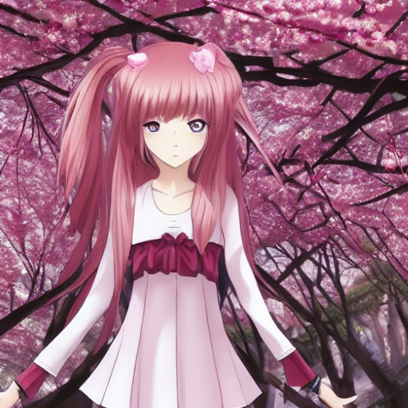
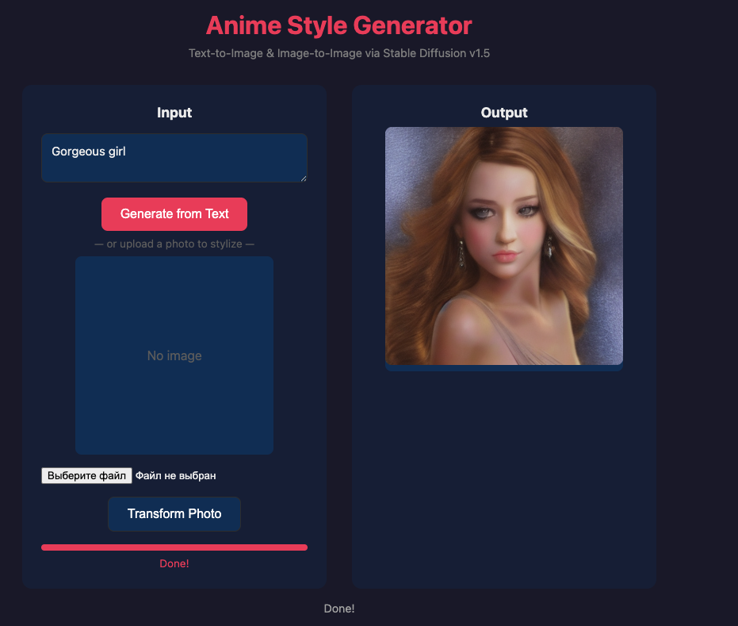
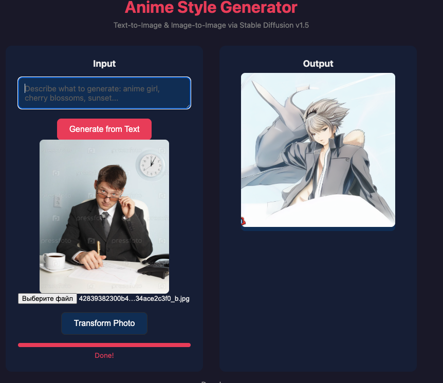

# Anime Style Generator

A local anime-style image generator powered by Stable Diffusion v1.5, built with Rust and [candle](https://github.com/huggingface/candle) for fast Metal GPU inference on Apple Silicon.



## Features

- **Text-to-Image** — Generate anime-style images from text prompts
- **Image-to-Image** — Transform existing photos into anime style
- **Metal GPU Acceleration** — Fast inference on Apple Silicon (M1/M2/M3/M4/M5)
- **Real-time Progress** — Live progress bar with step-by-step updates via SSE
- **Web UI** — Simple browser interface for uploading and processing images
- **CLI** — Command-line tool for batch processing
- **Fully Local** — No cloud APIs, all processing happens on your machine

## Performance

| Device | Steps | Resolution | Time |
|--------|-------|------------|------|
| Metal GPU (Apple M5) | 20 | 512x512 | ~40s |
| CPU | 20 | 512x512 | ~20min |

## Examples

### Text-to-Image

Prompt: `anime girl, cherry blossoms, beautiful, detailed`


Prompt: `Gorgeous girl`



### Image-to-Image

Input → Anime-styled output



## Quick Start

### Prerequisites

- Rust toolchain (rustup)
- macOS with Apple Silicon (for Metal GPU acceleration)

### 1. Clone and Build

```bash
git clone https://github.com/invweb/anime-style-rust.git
cd anime-style-rust
cargo build --release
```

### 2. Download Model

```bash
./download_model.sh
```

This downloads Stable Diffusion v1.5 (~2.5GB) to `./models/stable-diffusion-v1-5/`.

### 3a. Run CLI

```bash
# Text-to-image
./target/release/anime-cli \
  --prompt "anime girl, cherry blossoms" \
  --size 512 --steps 20 --f16

# Image-to-image
./target/release/anime-cli \
  --prompt "anime style, beautiful" \
  --image photo.jpg \
  --size 512 --steps 20 --f16
```

### 3b. Run Web Server

```bash
./target/release/anime-server
```

Open http://127.0.0.1:3000 in your browser.

## Configuration

Environment variables for the server:

| Variable | Default | Description |
|----------|---------|-------------|
| `MODEL_DIR` | `./models/stable-diffusion-v1-5` | Path to model directory |
| `STEPS` | `20` | Number of denoising steps |
| `F16` | `1` | Use fp16 weights (1=yes, 0=no) |

## CLI Options

```
anime-cli [OPTIONS] --prompt <PROMPT>

Options:
  -p, --prompt <PROMPT>      Text prompt for generation
  -i, --image <IMAGE>        Input image for img2img mode
  -o, --output <OUTPUT>      Output file [default: output.png]
  -s, --size <SIZE>          Image size [default: 512]
  -t, --steps <STEPS>        Denoising steps [default: 20]
      --model-dir <DIR>      Model directory
      --f16                  Use fp16 weights
      --strength <STRENGTH>  Img2img strength [default: 0.75]
```

## Tech Stack

- **Rust** — Core language
- **candle** — ML framework by Hugging Face (Metal GPU support)
- **candle-transformers** — Stable Diffusion implementation
- **axum** — Async web framework
- **tokio** — Async runtime
- **clap** — CLI argument parsing

## License

MIT
